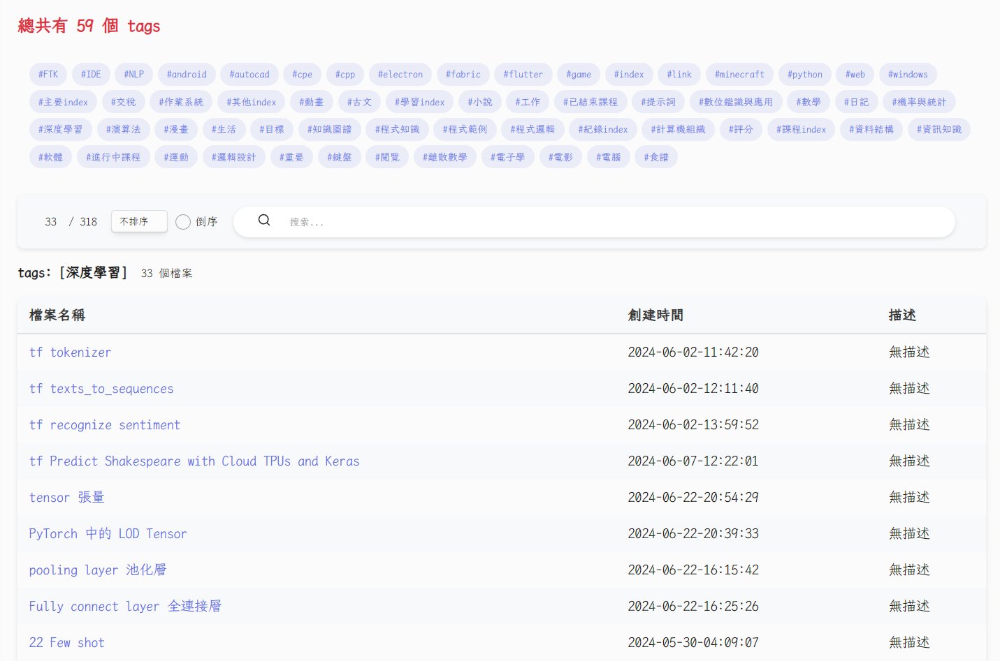

# Tag Search Page

## introduction
This plugin allows you to search file by tags.

本來使用 dataview 的 tag 搜尋，但發現有點慢，且不是很好控制，所以簡單寫了一個小插件。

## 功能
- tag button
- tag search bar

## 使用方法
- Open Homepage 命令打開首頁
- update-homepage 命令更新資料
  - 可以自行設定更新頻率

## 設定

- 設定頁面
  - frontmatter: 選擇要顯示的欄位，這個欄位需要 md 檔在 frontmatter 有設定，不然會顯示 null
  - frontmatterkey: 對應 frontmatter，顯示在表格的欄位，第一項默認是檔案