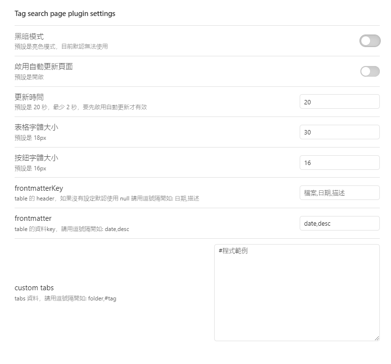

# Tag Search Page - Obsidian 插件

## 簡介
Tag Search Page 是一個專為 Obsidian 設計的強大插件，旨在提升您的標籤搜索體驗。本插件提供了一個直觀且高效的界面，讓您能夠輕鬆搜索和管理帶有特定標籤的文件。

此插件的誕生源於對 Dataview 標籤搜索功能的改進需求。我們發現 Dataview 的搜索速度較慢，且靈活性有限。因此，我們開發了這個輕量級且高度可定制的插件。

## 主要功能
1. **標籤按鈕**：直觀顯示所有可用標籤，點擊即可快速搜索。
2. **標籤搜索欄**：支持手動輸入標籤進行精確搜索。
3. **自動更新**：可設置自動更新頻率，確保搜索結果始終最新。
4. **自定義顯示欄位**：靈活設置要顯示的 frontmatter 欄位。
5. **排序功能**：支持結果排序，提供升序和降序選項，可以使用 frontmatter 欄位進行排序。
6. **字體大小調整**：可自定義表格和標籤按鈕的字體大小。
7. **文件計數**：實時顯示搜索結果的文件數量。

## 使用方法
- 使用 `Open Homepage` 命令打開插件主頁面。
- 使用 `update-homepage` 命令手動更新數據。
- 在設置中配置自動更新頻率。

## 設置選項

在插件設置頁面，您可以：
- 啟用/禁用自動更新
- 設置自動更新時間間隔（最短 2 秒）
- 調整表格和標籤按鈕的字體大小
- 自定義要顯示的 frontmatter 欄位和對應的表頭
- 透過 frontmatter 對欄位進行排序

### frontmatter 設置
- `frontmatter`：選擇要顯示的欄位，這些欄位需要在 Markdown 文件的 frontmatter 中定義。
- `frontmatterkey`：對應 frontmatter 欄位在表格中顯示的標題，第一項默認為文件名。

## 注意事項
- 確保您的 Markdown 文件在 frontmatter 中正確設置了標籤和其他自定義欄位。
- 插件目前不支持暗黑模式，預設使用亮色主題。

我們希望 Tag Search Page 能夠大大提升您在 Obsidian 中管理和搜索標籤的效率。如有任何問題或建議，歡迎反饋！

## 下一步
[需求頁面](require.md)